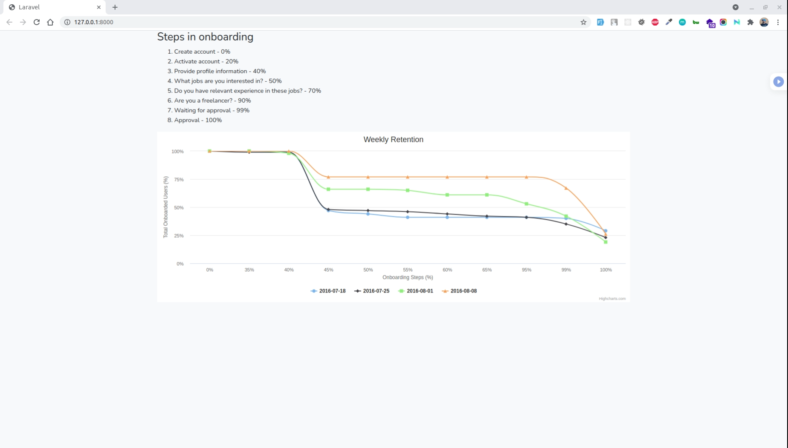

# Temper PHP Assessment

This project is proving a solution to Temper to get an idea of how users are performing in the Onboarding Flow

## Server Requirements

- PHP >= 7.3
- BCMath PHP Extension
- Ctype PHP Extension
- Fileinfo PHP Extension
- JSON PHP Extension
- Mbstring PHP Extension
- OpenSSL PHP Extension
- PDO PHP Extension
- Tokenizer PHP Extension
- XML PHP Extension
- Composer

## Setup Instructions

1. Download or clone the repository
2. `cd {project_directory}` into the project directory
3. Rename `.env.example` as `.env`
4. Run `composer update`
5. Run `php artisan key:generate`
6. Run `npm install`
7. Run `npm run dev`
8. Run `php artisan serve`

## API Documentation
For api documentation visit :
`{domain_name}/api/documentation`

Ex: http://127.0.0.1:8000/api/documentation

## Screenshot

